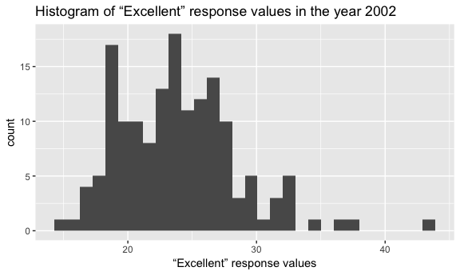
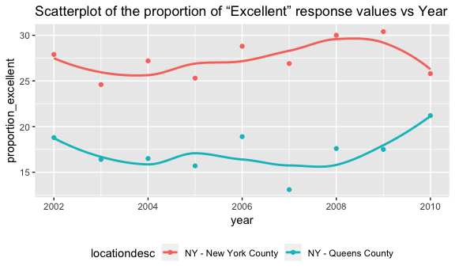

p8105\_hw2\_mm5354
================
Mengran Ma
2018/9/25

Problem 1
=========

##### Read and clean the data

``` r
transit_data = 
  read_csv("./NYC_Transit_Subway_Entrance_And_Exit_Data.csv") %>% 
  janitor::clean_names() %>% 
  #Retain line, station, name, station latitude / longitude, routes served, entry, vending, entrance type, and ADA compliance. 
  select(., line, station_name, station_latitude, station_longitude, route1:route11, entry, vending, entrance_type, ada) %>% 
  #Convert the entry variable from character (YES vs NO) to a logical variable 
  mutate(., entry = recode(entry, YES = TRUE, NO = FALSE))
```

    ## Parsed with column specification:
    ## cols(
    ##   .default = col_character(),
    ##   `Station Latitude` = col_double(),
    ##   `Station Longitude` = col_double(),
    ##   Route8 = col_integer(),
    ##   Route9 = col_integer(),
    ##   Route10 = col_integer(),
    ##   Route11 = col_integer(),
    ##   ADA = col_logical(),
    ##   `Free Crossover` = col_logical(),
    ##   `Entrance Latitude` = col_double(),
    ##   `Entrance Longitude` = col_double()
    ## )

    ## See spec(...) for full column specifications.

##### Write a short paragraph about this dataset – explain briefly what variables the dataset contains, describe your data cleaning steps so far, and give the dimension (rows x columns) of the resulting dataset. Are these data tidy?

``` r
nrow(transit_data)
```

    ## [1] 1868

``` r
ncol(transit_data)
```

    ## [1] 19

This dataset contains the following variables: line, station, name, station latitude, station longitude, routes served, entry, vending, entrance type, and ADA compliance.Data cleaning step so far is cleaning variable/column name for each column using clean\_names() function from janitor package, in order to remove special characters like spaces in the variable names.The dimension of this resulting dataset is 1868 rows by 19 columns. Are these data tidy? I don't think this dataset is tidy at all, because from route1 to route11, these 11 variables/columns contain so many missing values (NAs) and these 11 variables seem too complicated for us to find out/look for useful information from them. We can just simply reformat data so that route number (1-11) and route name (A, B, C, D, Q, R...) are distinct variables.

##### How many distinct stations are there?

``` r
count(distinct(transit_data, station_name, line))
```

    ## # A tibble: 1 x 1
    ##       n
    ##   <int>
    ## 1   465

#### How many stations are ADA compliant?

``` r
sum(distinct(transit_data, station_name, line, ada)$ada == TRUE)
```

    ## [1] 84

##### What proportion of station entrances / exits without vending allow entrance?

``` r
sum(transit_data$vending == "NO")
```

    ## [1] 183

``` r
sum(transit_data$vending == "NO" & transit_data$entry == TRUE)/sum(transit_data$vending == "NO")
```

    ## [1] 0.3770492

#### Reformat data so that route number and route name are distinct variables. How many distinct stations serve the A train? Of the stations that serve the A train, how many are ADA compliant?

``` r
transit_tidy_data = gather(transit_data, key = route_number, value = route_name, route1:route11) %>% 
#transit_tidy_data[!is.na(transit_tidy_data$train), ]
  filter(.,route_name == "A")
count(distinct(transit_tidy_data, station_name, line))
```

    ## # A tibble: 1 x 1
    ##       n
    ##   <int>
    ## 1    60

``` r
transit_tidy_data = filter(transit_tidy_data, transit_tidy_data$ada == TRUE)
count(distinct(transit_tidy_data, station_name, line))
```

    ## # A tibble: 1 x 1
    ##       n
    ##   <int>
    ## 1    17

Problem 2
=========

##### Read and clean the Mr. Trash Wheel sheet:

1.  specify the sheet in the Excel file and to omit columns containing notes (using the range argument and cell\_cols() function)
2.  use reasonable variable names
3.  omit rows that do not include dumpster-specific data
4.  rounds the number of sports balls to the nearest integer and converts the result to an integer variable (using as.integer)

``` r
#Specify the sheet in the Excel file and to omit columns containing notes (using the range argument and cell_cols() function)
Trash_Wheel = 
  readxl::read_excel("./HealthyHarborWaterWheelTotals2018-7-28.xlsx", sheet = 1, range = ("A2:N338")) %>% 
  janitor::clean_names() %>% 
  #Omit rows that do not include dumpster-specific data
  filter(!is.na(dumpster)) %>% 
  #Rounds the number of sports balls to the nearest integer and converts the result to an integer variable (using as.integer)
  mutate(., sports_balls = as.integer(ceiling(sports_balls)))
```

#### Read and clean precipitation data for 2016 and 2017. For each, omit rows without precipitation data and add a variable year. Next, combine datasets and convert month to a character variable (the variable month.name is built into R and should be useful).

``` r
Precipitation2016 = 
  readxl::read_excel("./HealthyHarborWaterWheelTotals2018-7-28.xlsx", sheet = 5, skip = 1) %>% 
  janitor::clean_names()
```

``` r
Precipitation2017 = 
  readxl::read_excel("./HealthyHarborWaterWheelTotals2018-7-28.xlsx", sheet = 4, skip = 1) %>% 
  janitor::clean_names()
```

``` r
Precipitation2016noNa = na.omit(Precipitation2016, cols = seq_along(Precipitation2016)) %>% 
  mutate(., year = "2016")
Precipitation2017noNa = na.omit(Precipitation2017, cols = seq_along(Precipitation2017)) %>% 
  mutate(., year = "2017")
```

``` r
Join_data = left_join(Precipitation2016noNa, Precipitation2017noNa, by = "month")
Join_data[, 1] <- month.name[sapply(Join_data[, 1], as.integer)]
```

In the first dataset Mr. Transh Wheel, it contains 285 rows by 14 columns after data cleaning in steps above. This dataset consists of records about dumpster numbers, time of collection and types of litters being collected. My data cleaning step included cleaning variable names using clean\_names() this function from janitor package. As for Precipitation data for 2016, it contains 13 rows by 2 columns after data cleaning in steps above. Precipitation data for 2017 contains 13 rows by 2 columns after data cleaning in steps above.

Number of observations in both Mr. Trash Wheel and 2016&2017 Precipitation resulting datasets: 285 for Mr. Trash Wheel sheet and 14 for precipitation data for 2016 and 2017 in total. For available data,the total precipitation in 2017 is 32.93 The median number of sports balls in a dumpster in 2016 is 26.

Problem 3
=========

For this question: 1. format the data to use appropriate variable names; 2. focus on the “Overall Health” topic 3. exclude variables for class, topic, question, sample size, and everything from lower confidence limit to GeoLocation 4. structure data so that responses (excellent to poor) are variables taking the value of Data\_value 5. create a new variable showing the proportion of responses that were “Excellent” or “Very Good”

1.  How many unique locations are included in the dataset? Is every state represented? What state is observed the most?
2.  In 2002, what is the median of the “Excellent” response value?
3.  Make a histogram of “Excellent” response values in the year 2002.
4.  Make a scatterplot showing the proportion of “Excellent” response values in New York County and Queens County (both in NY State) in each year from 2002 to 2010

``` r
data("brfss_smart2010")
brfss = janitor::clean_names(brfss_smart2010) %>% 
  #Focus on the “Overall Health” topic
  filter(.,topic == "Overall Health") %>% 
  #Exclude variables for class, topic, question, sample size, and everything from lower confidence limit to GeoLocation
  select(., -class, -topic, -question, -sample_size) %>% 
  select(., year:data_value)
```

#### Structure data so that responses (excellent to poor) are variables taking the value of Data\_value

``` r
brfss_structure = spread(brfss, key = "response", value = "data_value") %>% 
#Create a new variable showing the proportion of responses that were “Excellent” or “Very Good”
  mutate(., propotion_response = Excellent + `Very good`)
```

#### How many unique locations are included in the dataset? Is every state represented? What state is observed the most?

``` r
length(unique(brfss$locationdesc)) 
```

    ## [1] 404

``` r
length(unique(brfss$locationabbr))
```

    ## [1] 51

``` r
#Therefore, every state is represented. 
names(which.max(table(brfss$locationabbr))) 
```

    ## [1] "NJ"

#### In 2002, what is the median of the “Excellent” response value?

``` r
brfss_responsevalue = filter(brfss, brfss$response == "Excellent" & brfss$year == 2002) 
summary(brfss_responsevalue$data_value)
```

    ##    Min. 1st Qu.  Median    Mean 3rd Qu.    Max.    NA's 
    ##   14.60   20.35   23.60   23.96   26.90   43.20       2

#### Make a histogram of “Excellent” response values in the year 2002.

``` r
ggplot(brfss_responsevalue, aes(x = brfss_responsevalue$data_value)) + 
  geom_histogram() +
  labs(x = "“Excellent” response values", 
       title = "Histogram of “Excellent” response values in the year 2002")
```

    ## `stat_bin()` using `bins = 30`. Pick better value with `binwidth`.

    ## Warning: Removed 2 rows containing non-finite values (stat_bin).



#### Make a scatterplot showing the proportion of “Excellent” response values in New York County and Queens County (both in NY State) in each year from 2002 to 2010.

``` r
brfss_responseNY = spread(brfss, key = "response", value = "data_value") %>% 
  mutate(., proportion_excellent = Excellent) %>% 
  filter(., locationdesc == "NY - New York County" | locationdesc == "NY - Queens County")
 
ggplot(brfss_responseNY, aes(x = year, y = proportion_excellent, color = locationdesc)) + 
  geom_point() +
  geom_smooth(se = FALSE) +
  labs(title = "Scatterplot of the proportion of “Excellent” response values vs Year") +
  theme(legend.position = "bottom")
```

    ## `geom_smooth()` using method = 'loess' and formula 'y ~ x'


